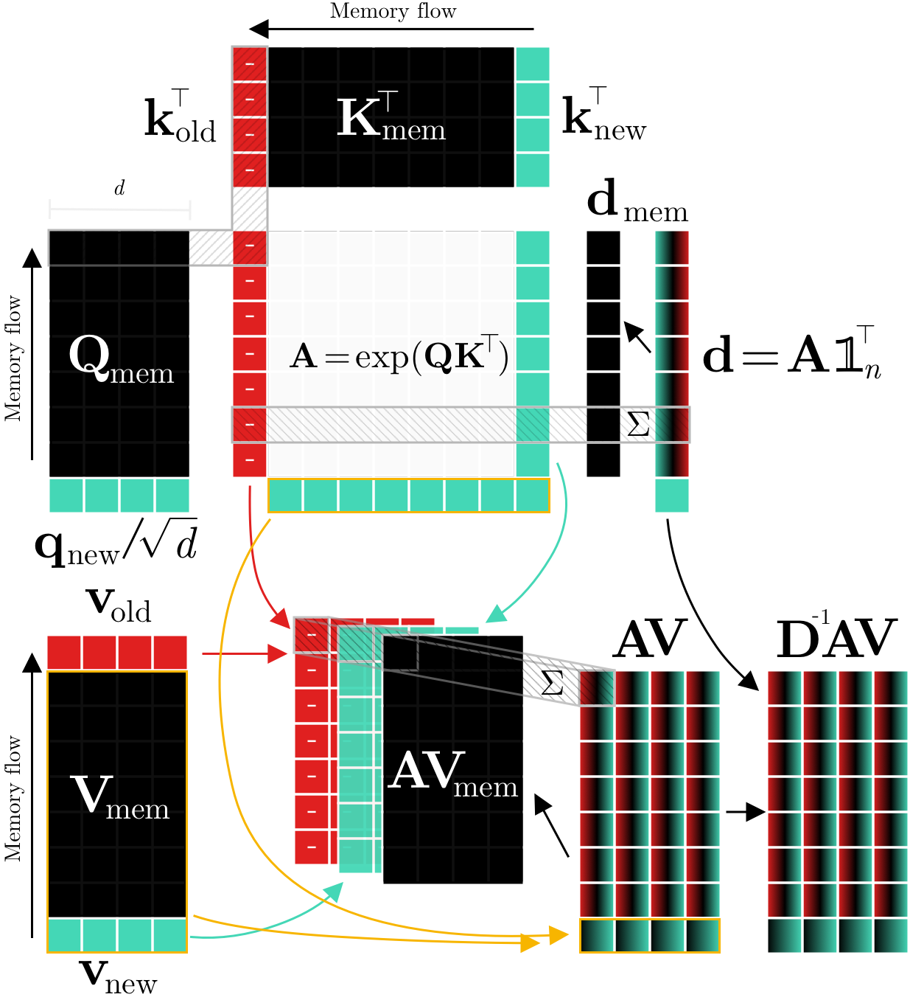
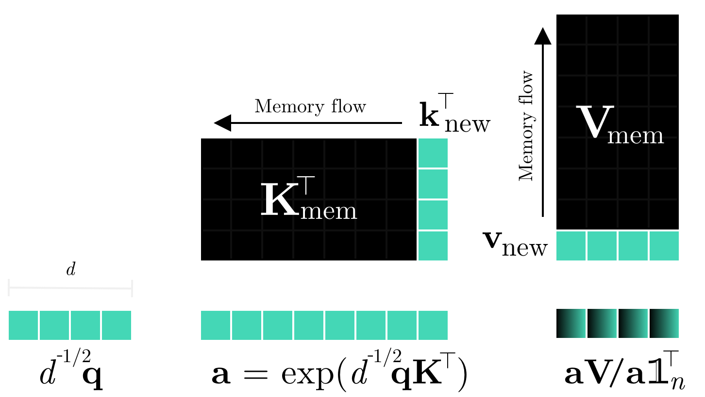
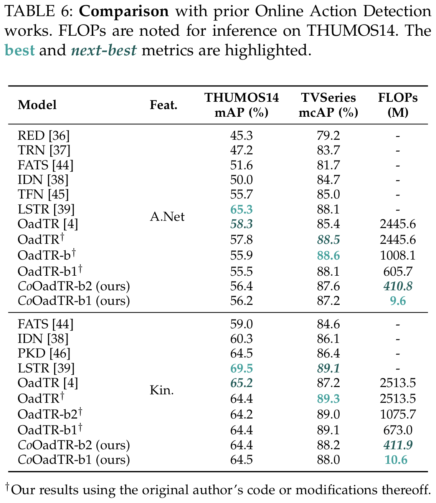
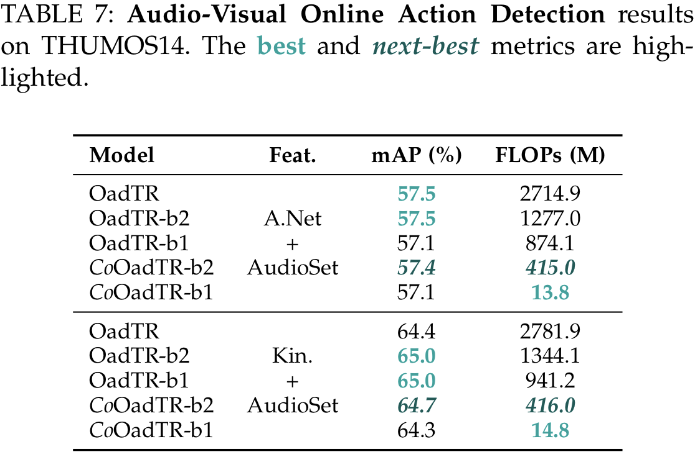

# Continual Transformers: Redundancy-Free Attention for Online Inference

<div align="left">
  <!-- <a href="https://pypi.org/project/continual-transformers/">
    
  </a> -->
  <a href="http://arxiv.org/abs/2201.06268">
    
  </a>
  <!-- <a href="https://badge.fury.io/py/continual-transformers">
    
  </a> -->
  <!-- <a href="https://pepy.tech/project/continual-transformers">
    
  </a> -->
  <a href="https://codecov.io/gh/LukasHedegaard/continual-transformers">
    
  </a>
  <a href="https://opensource.org/licenses/Apache-2.0">
    
  </a>
  <a href="https://github.com/psf/black">
    
  </a>
</div>

Official implementation of [Continual Transformers](http://arxiv.org/abs/2201.06268) including ready-to-use modules for [Continual Inference](https://github.com/LukasHedegaard/continual-inference).

<div align="center">
  
  <br>
  <div align="left">
  Fig. 1: Continual Retroactive Dot-Product Attention. 
  The query (Q), key (K), and value (V) matrices are aggregated over time by caching the step vectors q_n, k_n, and v_n in a FIFO queue. During each step, only the entries of A associated with q_n, k_n, and the oldest K step, k_o are computed. 
  The diagonal entries of the row-normalisation matrix D as well as the AV can be updated retroactively by subtracting features corresponding to k_o and adding features related to k_n to the cached outputs of the previous step, D_{mem} and AV_{mem}, respectively.
  </div>
  <br>
</div>

<div align="center">
  
  <br>
  <div align="left">
  Fig. 2: Continual Single-Output Dot-Product Attention. 
        The key (K) and value (V) matrices are aggregated over time by caching the step vectors k_n and v_n in a FIFO queue. During each step, only the attention output associated with q is computed.
  </div>
  <br>
</div>


## Setup

Continual Transformers and its modules can be installed in in your project using:
```setup
pip install git+https://github.com/LukasHedegaard/continual-transformers.git
```


## Experiments and results
The experiment code-base is split into seperate repositories for [Online Action Detection](https://github.com/LukasHedegaard/CoOadTR) and [Online Audio Classification](https://gitlab.au.dk/maleci/continual-transformer-audio-classification). Below, we present a summary of result from the paper. 

<div align="center">
  
</div>


<div align="center">
  <br>
  
</div>


## Citation   
```
@article{hedegaard2022cotrans,
  title={Continual Transformers: Redundancy-Free Attention for Online Inference},
  author={Lukas Hedegaard and Alexandros Iosifidis},
  journal={preprint, arXiv:2201.06268},
  year={2022}
}
```

## Contributing

See [CONTRIBUTING.md](CONTRIBUTING.md)
